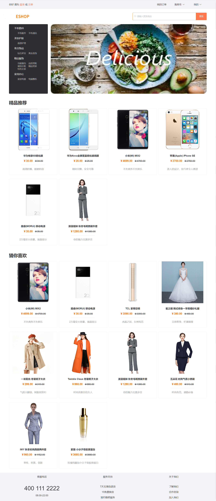
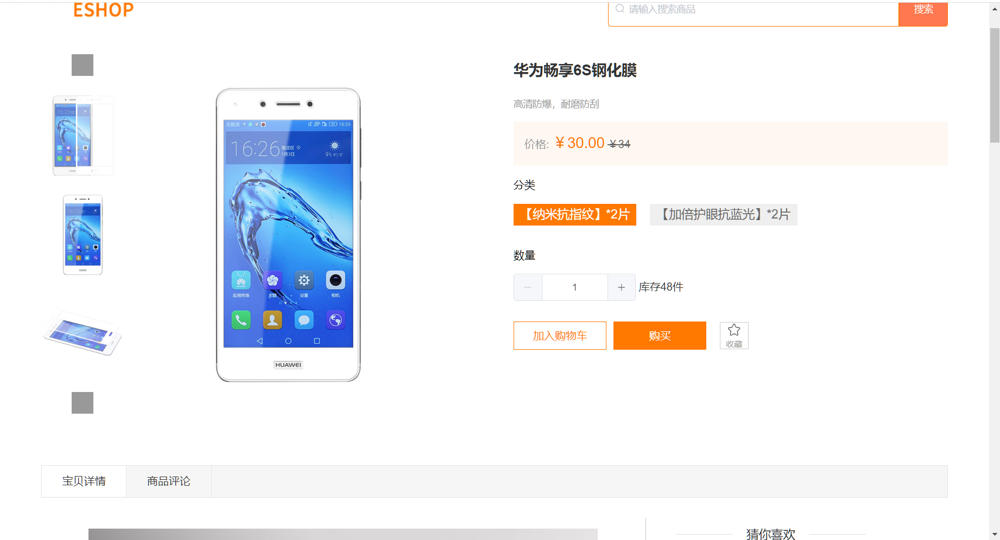
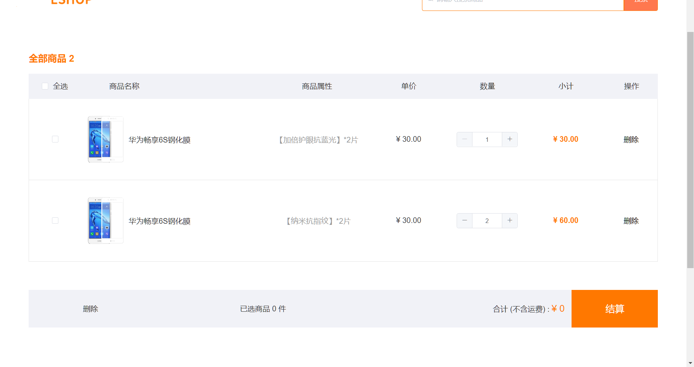
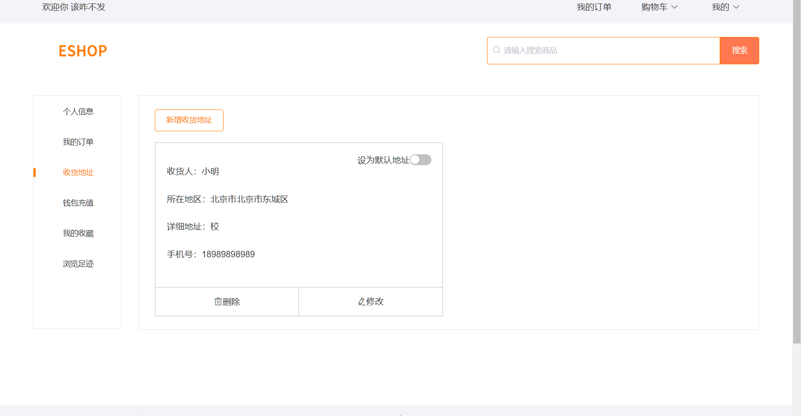
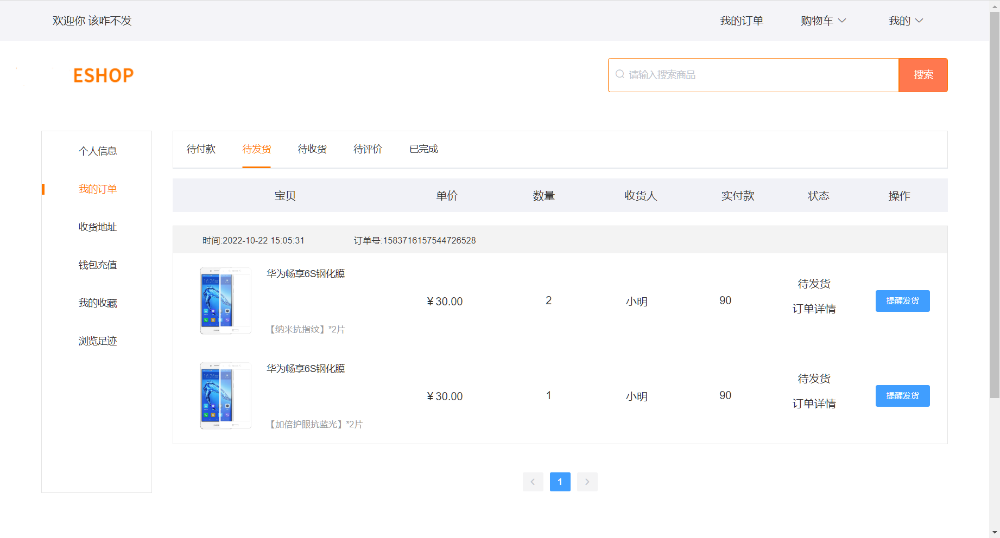
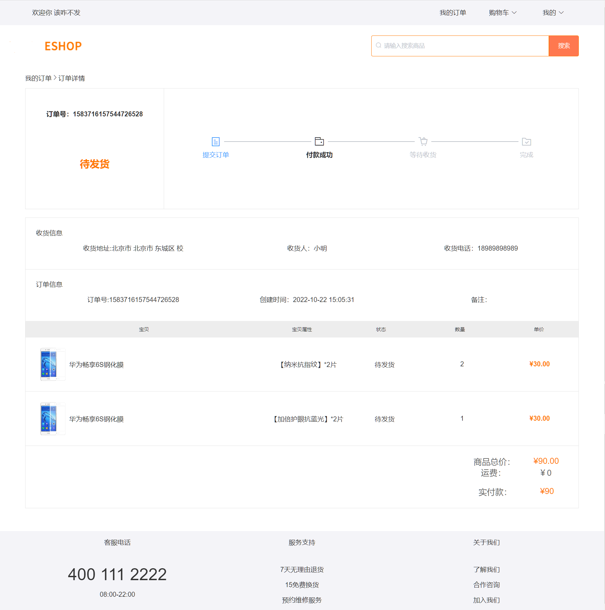

# carefree-shop-pc-vue2

## 无忧商城

> 一个基于vue2的商城PC前端项目,使用了Element UI
> 参考天猫商城的购物流程：用户从注册开始，到完成登录，浏览商品，加入购物车，进行下单，确认收货，等一系列操作

## 项目预览

+ 前台演示地址：<https://meimengpc.netlify.app>

### 项目界面

+ ##### 界面(部分)---
+ 
+ 
+ 
+ 
+ 
+ 

### 注意事项：

1.该项目为练习作品，部分页面跳转未完善，但以完成用户注册，登录，浏览商品，加入购物车，添加地址，模拟充值，进行下单，确认收货，查看订单等一系列功能

2.项目后端部署在腾讯云函数上，返回数据较慢。

~~3.图片放置在七牛云海外存储，返回较慢，甚至不返回~~ (无法使用https 弃用)

4.将图片放置在自建图床床上

图床测试图片

### 环境依赖

> + nodejs 12.22.11
> + less: "^3.9.0",

